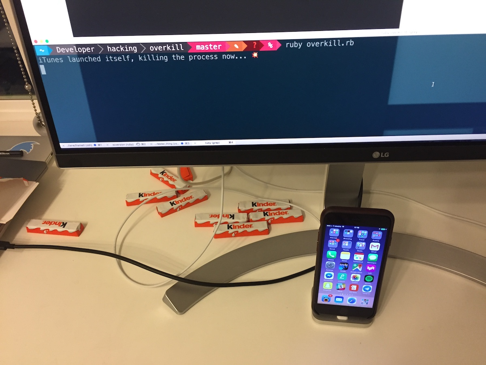
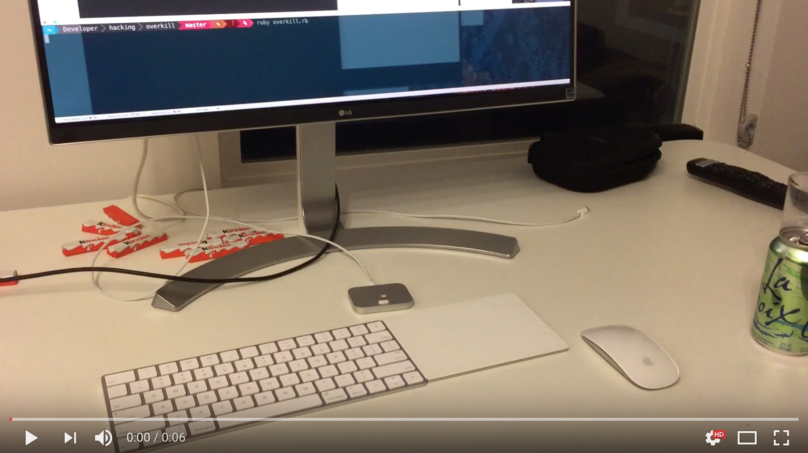

# Overkill

Did iTunes ever launch without you opening the app? 

Use _overkill_ to instantly kill iTunes once it opened itself.

Reasons why iTunes launches:

- You connect an iPhone or iPad to your Mac
- You click play/pause while listening to a web-based music player (e.g. SoundCloud)
- You launch iTunes by clicking on the icon by mistake
- Someone sent you a link to an iOS app
- You click on a link on the web, and didn't expect it to be an Music link
- You open a file in Finder, and forgot to change the default app to VLC

Another nice benefit of this is that you don't have to manually close iTunes when you update your Xcode installation.



I first tweeted about this idea [over a year ago](https://twitter.com/krausefx/status/649706992655708164).

#### Video Demo:



## Usage

```
ruby overkill.rb
```

To launch process in the background use

```
ruby overkill.rb &
```

## Disclaimer

This repo is meant as a joke, the script uses polling to monitor the active processes.
